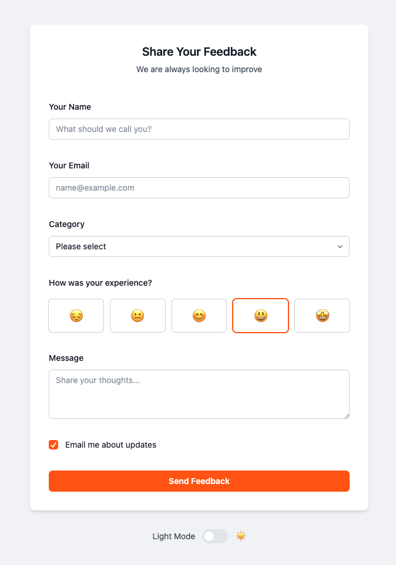
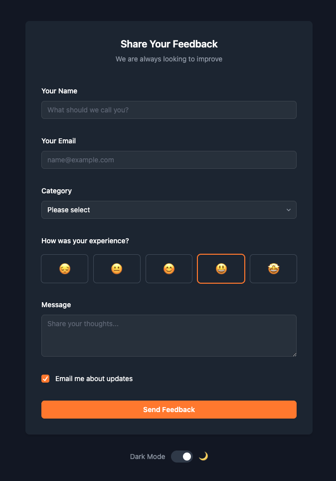
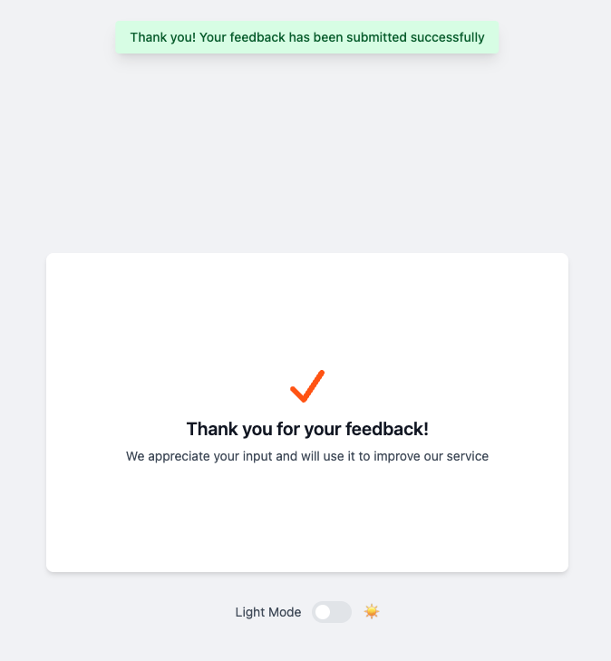
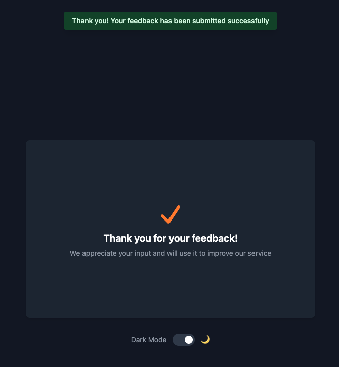

# Vue 3 Feedback Form

This repository contains the full source code for the step-by-step [YouTube tutorial](https://www.youtube.com/watch?v=1Oq0zHVdTyM), where you'll learn how to build a complete feedback form app from scratch using Vue 3, TypeScript, Vite, and Tailwind CSS.

You'll see how to set up the project, build the UI, manage form state, create reusable composables and components, add validation, handle loading states, show notifications, and support dark mode.

### Feedback Form

<div align="center" style="display: flex; gap: 16px;">
	
	
</div>

### Success Screen

<div align="center" style="display: flex; gap: 16px;">
	
	
</div>

## Getting Started

### Prerequisites

- Node.js (v20.19+ or v22.12+ required by Vite)
- npm

### Install dependencies

```bash
npm install
```

### Run the development server

```bash
npm run dev
```

Visit [http://localhost:5173](http://localhost:5173) to view the app.

## License

MIT
